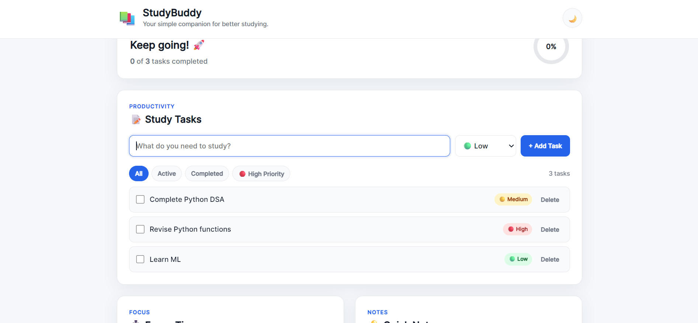

# 📚 StudyBuddy

> A simple study companion built for students who want to stay organized, focused, and consistent.

[🌐 Live Demo](https://vaibhavsarmai05-oss.github.io/StudyBuddy/?utm_source=chatgpt.com)

## 📸 Preview

### Dashboard



### Dark Mode


---

## 💡 Why StudyBuddy?

Students often switch between different tools for:

- 📝 Managing study tasks
- ⏱️ Staying focused
- 💡 Writing quick notes
- 📊 Tracking progress

StudyBuddy brings these simple tools together in one lightweight website.

It requires **no account, database, or API key**.

---

## ✨ Features

- 📝 Add and manage study tasks
- 🔴🟡🟢 Set task priorities
- ✅ Mark tasks as completed
- 🗑️ Delete tasks
- 🔎 Filter tasks by:
  - All
  - Active
  - Completed
  - High Priority
- 📊 Track task completion progress
- ⏱️ 25-minute focus timer
- 💡 Quick notes
- 💾 LocalStorage persistence
- 🌙 Dark mode
- 📱 Responsive design

---

## 🛠️ Built With

- **HTML5**
- **CSS3**
- **JavaScript**
- **Browser LocalStorage**

No frameworks or external APIs are required.

---

## 🚀 Run Locally

### 1. Clone the repository

```bash
git clone https://github.com/vaibhavsarmai05-oss/StudyBuddy.git
```

### 2. Open the project

```bash
cd StudyBuddy
```

### 3. Run it

Open `index.html` in your browser.

For development, you can also use the **Live Server** extension in VS Code.

---

## 📁 Project Structure

```text
StudyBuddy/
│
├── index.html
├── style.css
├── script.js
├── README.md
│
└── screenshots/
    ├── dashboard.png
    └── dark-mode.png
```

---

## 🔐 Privacy

StudyBuddy does not require an account and does not send your tasks or notes to a server.

Your:

- Tasks
- Notes
- Theme preference

are stored locally in your browser using **LocalStorage**.

---

## 🤝 Contributing

Contributions are welcome!

If you would like to improve StudyBuddy:

1. Fork the repository
2. Create a new branch
3. Make your changes
4. Test your changes
5. Open a Pull Request

### 💭 Ideas for Future Improvements

- Custom timer durations
- Study streaks
- Subject categories
- Task deadlines
- Weekly statistics
- Keyboard shortcuts
- Improved accessibility

---

## 🏗️ Built for Students

StudyBuddy was created as a lightweight project focused on a simple idea:

**Make everyday studying a little easier without making the tool complicated.**

---

## 📄 License

This project is available under the **MIT License**.